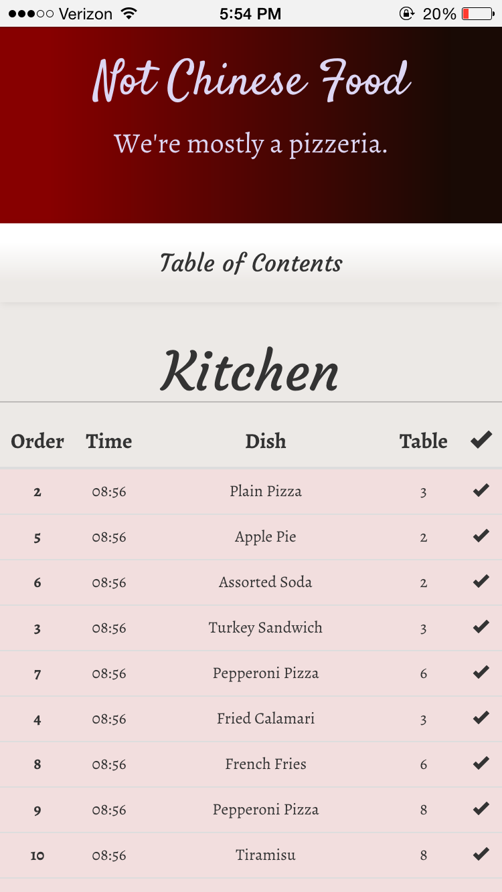
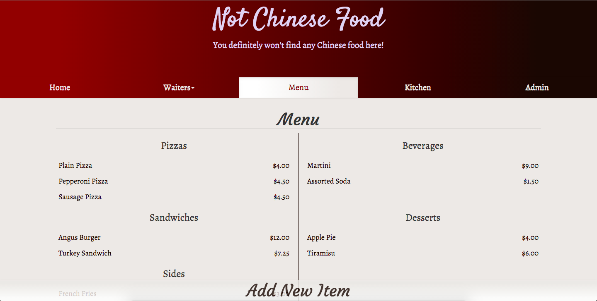

## Restaurant App

A mobile-first app designed for restaurant staff to manage incoming orders.

---

### Screenshots

---

### Languages & Frameworks

Ruby, Ruby on Rails, Sinatra, JavaScript, jQuery (UI, Mobile), HTML, CSS, Bootstrap.

---

### Functionality

* View all tables, parties, and orders on the landing page.
* Place orders by selecting them from the menu, remove them by swiping them left or right.
* Change a party's waiter, table, or size from the landing page.
* View receipts individually (including suggested tip amounts) and clear the table of a party after they have paid.
* As a waiter, view all of your current tables, as well as any open tables for new parties.
* Add new items to the menu, edit any preexisting items, or remove anything from the menu.
* As a chef, view all current orders, check off any completed orders, and sort priorities.
* Orders in the kitchen turn yellow when 15 minutes have elapsed since their creation, and red after 30 minutes.
* The administration control panel includes the ability to hire or fire waiters (waiters who are fired while still responsible for tables will finish clearing their tables before being removed fully), add or remove tables, and view order statistics.

---
